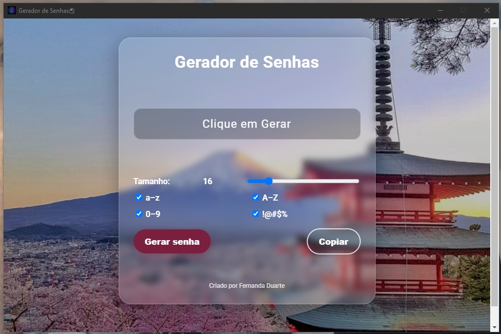

Bem vindo ao Gerador de senhas 🖤

App que criei para gerar senhas seguras de forma rápida e prática, sem precisar ficar acessando sites de terceiros.  
Ele foi feito com Electron, HTML, CSS e JavaScript, e tem uma interface simples, mas com um visual moderno usei efeito Fumê e Google Fonts Roboto.

Preview



 💻 o que você pode fazer com ele?
- Definir o tamanho da senha (de 6 a 64 caracteres)  
- Incluir letras maiúsculas, minúsculas, números e símbolos  
- Copiar a senha com um clique (ou clicando direto na caixa)  
- Ver um feedback visual (a caixa pisca quando a senha é copiada)  

 Tecnologias
- Electron  
- HTML + CSS (Glassmorphism e Google Fonts)  
- JavaScript (Clipboard API)  

Como rodar?
Clone o repositório e instale as dependências:

```bash
git clone https://github.com/DasilvaFernanda/geradordesenhas.git
cd geradordesenhas
npm install
npm start
